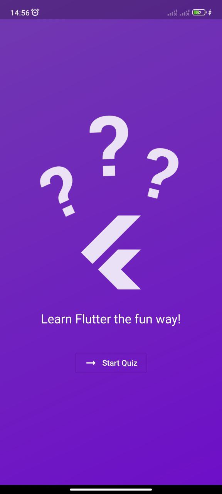
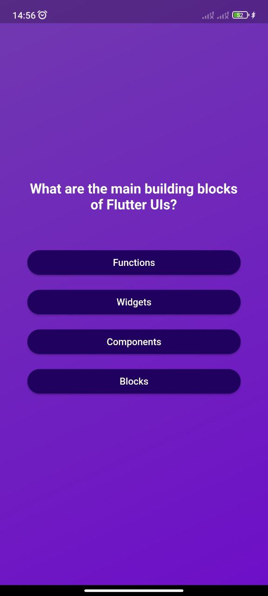
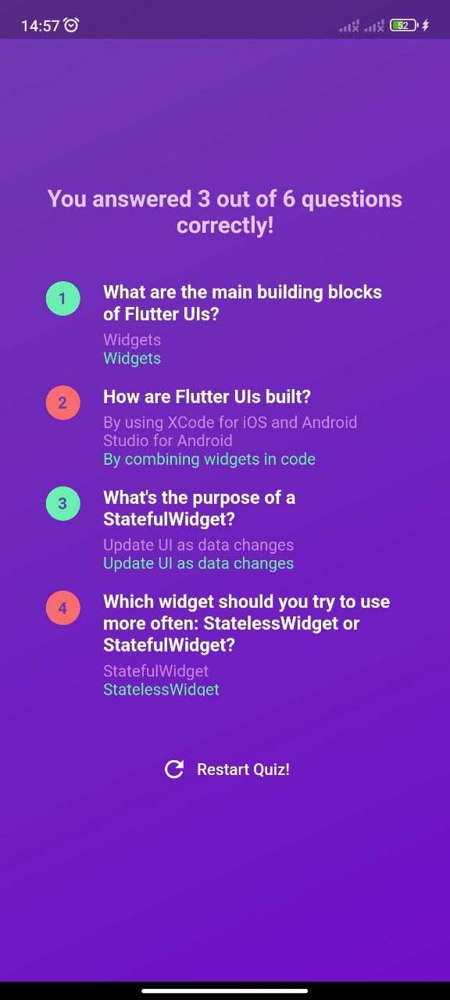

# Quiz application

The Flutter quiz application is a dynamic mobile app that engages users through interactive quiz offering a seamless and enjoyable learning of Flutter

## Screenshots
- Main page (plants list) 

- When clicked on a plant image 

- When clicked on the zoom icon 

## Getting Started

This project is a starting point for a Flutter application.

A few resources to get you started if this is your first Flutter project:

- [Lab: Write your first Flutter app](https://docs.flutter.dev/get-started/codelab)
- [Cookbook: Useful Flutter samples](https://docs.flutter.dev/cookbook)

For help getting started with Flutter development, view the
[online documentation](https://docs.flutter.dev/), which offers tutorials,
samples, guidance on mobile development, and a full API reference.
